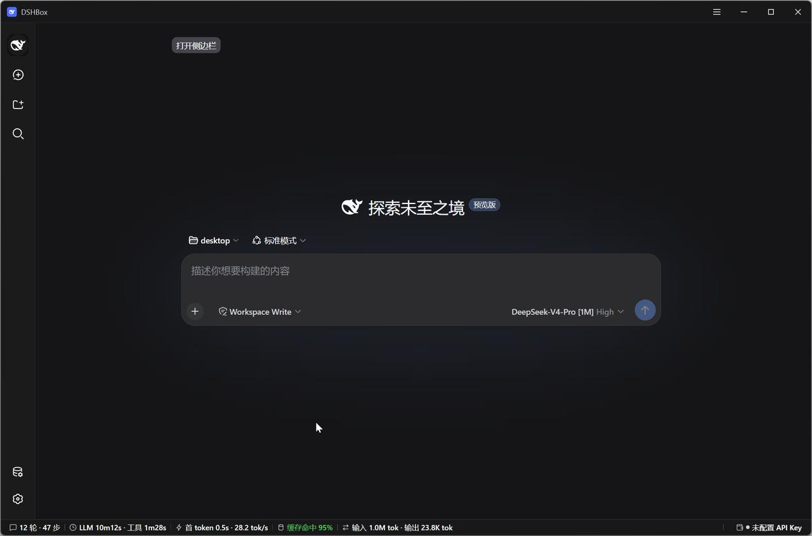
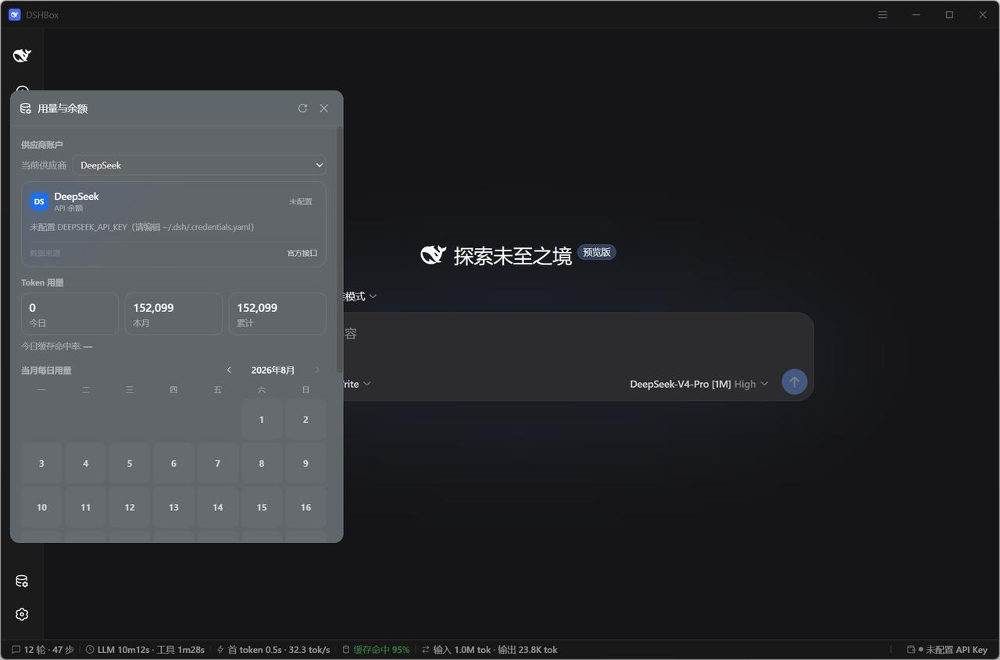

# DSHBox

<p align="center">
  
</p>

<p align="center">
  
  
  
</p>

[中文](README.md) · [Why a desktop shell](docs/why-desktop.md) · [Architecture](docs/architecture.md) · [Development](docs/development.md) · [Troubleshooting](docs/troubleshooting.md) · [Security model](docs/security.md)

DSHBox (`dsh-box`) is a cross-platform desktop shell for [DeepSeek Harness](https://github.com/deepseek-ai/deepseek-harness) (dsh), built with Tauri v2, Rust, and plain HTML/CSS/JavaScript. The main window loads the official `dsh web` UI; the shell handles the runtime, window, tray, updates, and local system integration without forking or patching dsh.

> [!IMPORTANT]
> Release artifacts remain unsigned; the operating system may ask for manual approval. See the [security model](docs/security.md) for details.

<p align="center">
  
</p>
<p align="center">
  
</p>

## Quick start

Install Rust 1.85+, Node.js `^22.19.0` or `>=24.0.0`, and the [Tauri v2 prerequisites](https://v2.tauri.app/start/prerequisites/) for your platform. On Windows:

```powershell
git clone https://github.com/JeffioZ/dsh-box.git
cd dsh-box
npm ci
npm run check
pwsh -NoLogo -NoProfile -File .\build.ps1
```

The Windows executable is written to `dist\DSHBox.exe`. For macOS and Linux requirements and build commands, see the [development guide](docs/development.md).

## Features

| Capability | Description |
|---|---|
| Works out of the box | Detects or installs Node.js and dsh, and guides Windows users through WebView2 setup when missing |
| Service lifecycle | OS-assigned port fallback, safe external-dsh attachment, child-process cleanup, watchdog recovery, and page heartbeat restoration |
| Desktop experience | Custom title/status bars, tray, notifications, window-state persistence, Windows 11 snap-layout flyout (with a Windows 10 fallback), light/dark themes, and Chinese/English UI |
| Secure updates | Transactional dsh/Node updates with interruption recovery; Windows app updates require an exact release tag and SHA-256 digest verification |
| Local file menu | Default open, VS Code/Notepad open, reveal in file manager, copy path, and copy UTF-8 contents |
| Plugin management | Search, install, uninstall, and update through the official `dsh plugin` CLI; first-run built-in plugins are explicitly optional |
| Usage and balance | Per-day/per-model token aggregation, month heatmap, recent 14 days with model drill-down; provider balance and subscription cards with background monitoring, stale-on-error retention, and low-balance warnings |
| Model configuration | Typed validation and import/export of custom `llm-pi-ai` routes, with credentials stored separately from settings |
| Portable mode | Place `portable.txt` next to the Windows exe to keep the runtime and configuration in an adjacent `data/` directory |

## Platforms

| Platform | Architecture | Minimum environment | Artifact |
|---|---|---|---|
| Windows | x64 | Windows 10; WebView2 Runtime | Single `DSHBox.exe` |
| macOS | arm64 / x64 | macOS 13.5+ | Unsigned dmg |
| Linux | x64 / arm64 | Ubuntu 22.04, Debian 12, or an equivalent WebKitGTK 4.1 environment | zip |

Windows is the primary locally tested platform; GitHub Actions builds all five targets. On Linux, dsh's Landlock requires kernel 5.13+; older kernels degrade inside dsh itself.

## Installation and first run

Download the matching artifact from [Releases](https://github.com/JeffioZ/dsh-box/releases):

- Windows: run `DSHBox.exe`.
- macOS: drag the app into Applications. If Gatekeeper blocks it, Control-click the app and choose "Open", or allow it under "System Settings → Privacy & Security".
- Linux: unpack and run `DSHBox`; install your distribution's WebKitGTK 4.1 dependencies first.

The first launch prepares the runtime (the installation can be cancelled at any time without exiting the app) and then shows the first-run setup page. Every choice can be left at its default or skipped—the DeepSeek API key can also be left blank, and everything can be changed later in Settings:

1. The API key is written to dsh's `$DSH_HOME/.credentials.yaml` and never copied into DSHBox's `config.json`.
2. Language and theme are written to dsh's `settings.yaml`, shared with the official CLI/Web UI.
3. Launch-at-login uses each platform's native mechanism.
4. "Install built-in plugins" is checked by default but can be unchecked; when unchecked, nothing is installed automatically.

The key can later be replaced or cleared under "Settings → Service → DeepSeek API key"; when an environment variable provides the key, that section is read-only and marked as externally managed.

## Configuration and data

### Data directories

Default data root:

| Platform | Path |
|---|---|
| Windows | `%LOCALAPPDATA%\DSHBox` |
| macOS | `~/Library/Application Support/com.deepseek.dsh-box` |
| Linux | `$XDG_DATA_HOME/com.deepseek.dsh-box`, or `~/.local/share/com.deepseek.dsh-box` when unset |

### Directory contents

- `config.json`: user-facing shell settings.
- `state.json`: window state, onboarding, and background maintenance flags; not meant for manual editing.
- `node/`, `dsh/`, `package-manager/`: the Node, dsh, and pinned-pnpm runtimes managed by DSHBox.
- `npm-cache/`, `pnpm-store/`: local package caches shared by installation and plugin maintenance.
- `logs/dshbox.log`: UTC log, rotated to `.old` beyond 2 MiB.
- `$DSH_HOME`: defaults to `~/.dsh`; owned by the official dsh and shared with DSHBox, outside the data root above.

### config.json

`config.json` supports:

```json
{
  "port": 18080,
  "api_base": "https://api.deepseek.com",
  "language": "zh-CN",
  "hide_tool_calls": false,
  "hide_stats_line": true,
  "hide_statusbar": false,
  "hide_balance": false,
  "auto_update_plugins": true,
  "task_notifications": true,
  "dsh_update_channel": "latest",
  "close_behavior": "tray",
  "launch_behavior": "window",
  "download_source": "auto"
}
```

`dsh_update_channel` is `latest` or the riskier preview channel `next`. `close_behavior` is `tray` / `quit`, `launch_behavior` is `window` / `tray`, and `download_source` is `auto` / `official` / `mirror`. `config.json` and `state.json` have strictly separated ownership and never fall back to each other's fields.

### Port policy

`port` is the preferred port for the locally managed service, not a fixed port DSHBox must occupy. DSHBox first tries the last successful port and the preferred port; if neither is available, it runs `dsh web --port 0` so the OS allocates a free port atomically, records the result in `state.json`, and never scans a large adjacent range.

### Attaching to an external dsh service

At startup, if an external dsh verified through both the page marker and `host.describe` is found on the preferred port or dsh's official default port `3080`, DSHBox asks before connecting and remembers that service fingerprint. On first run this choice takes precedence over local settings; choosing the external service defers the credential and plugin onboarding that only applies to a local runtime, and it appears later on the first switch to the local service. External mode only displays and reconnects: DSHBox never stops, restarts, or updates that process, nor rewrites its credentials, models, or plugins; if the service disappears, the app reports it clearly and the user can retry or deliberately switch to the local service.

### Environment variables

Environment variables take precedence over `config.json`:

| Variable | Effect |
|---|---|
| `DSH_BOX_ROOT` | Overrides the data root |
| `DSH_BOX_PORT` | Overrides the listening port |
| `DSH_BOX_API_KEY` | Overrides the DeepSeek API key |
| `DSH_BOX_API_BASE` | Overrides the API base URL |
| `DSH_HOME` | Overrides dsh's official home directory |
| `DSHD_LANG` | Pins `zh-CN` or `en` |

API key resolution order: `DSH_BOX_API_KEY` → `DEEPSEEK_API_KEY` → `$DSH_HOME/.credentials.yaml`.

## Built-in plugins

The first-run setup can install:

- [DSH Market](https://github.com/dsh-market/dsh-market) (`dshmarket`)
- [DSH File Upload](https://github.com/HongMing-Huang/dsh-file-upload) (`dsh-file-upload`)

After consent, built-in plugins that are not yet installed are installed once dsh is ready; installed plugins that keep their built-in identity are checked for updates every 24 hours. When a built-in plugin is replaced, an older package still managed by DSHBox migrates to the new one; if the user previously uninstalled the old package, that choice stands and the new package is not installed on the old package's behalf. After a user-initiated uninstall, the plugin page keeps a manual reinstall entry; a reinstalled plugin is managed as an ordinary user plugin and does not regain the built-in badge or automatic updates. Install, update, and uninstall all go through the `dsh plugin` CLI; multiple changes are merged into a single service restart, and automatic maintenance waits until the session is idle.

The plugin page also lists "community plugins" with source links and manual install entries only—no automatic installation or updates; after uninstalling, a plugin reappears in that list.

Plugins are third-party code executed in the same environment as dsh. Neither the community list nor built-in or market inclusion is a security endorsement; verify the source before installing. For the manifest maintenance rules, see [resources/README.md](src-tauri/resources/README.md).

## Development

You need Rust 1.85+, Node.js `^22.19.0` or `>=24.0.0`, and the Tauri system dependencies for your platform. PowerShell 7 is recommended on Windows.

```powershell
npm install
npm run check
cargo fmt --manifest-path src-tauri/Cargo.toml -- --check
cargo clippy --manifest-path src-tauri/Cargo.toml --all-targets -- -D warnings
cargo test --manifest-path src-tauri/Cargo.toml --all-targets
```

Windows build and development:

```powershell
pwsh -NoLogo -NoProfile -File .\build.ps1
pwsh -NoLogo -NoProfile -File .\dev-build.ps1
pwsh -NoLogo -NoProfile -File .\dev-run.ps1
```

Development mode loads `ui/` from a local server on port 4321, so UI-only changes need no Rust rebuild. For the full environment, icons, and release process, see the [development guide](docs/development.md).

## Project structure

```text
desktop/
├─ assets/brand/                   # single brand SVG source
├─ ui/                             # bundler-free built-in pages, shared styles, bilingual copy
│  ├─ index.html + startup.*       # startup page and first-run setup
│  ├─ control-center.*             # balance/updates/plugins/settings/about
│  ├─ titlebar.* / statusbar.*     # main-window sub-webviews
│  ├─ tray-menu.html + menu.js     # tray and menu interaction
│  └─ common.* + i18n.js           # shared utilities, design tokens, copy
├─ src-tauri/
│  ├─ resources/                   # built-in plugin manifest and page-injection resources
│  └─ src/
│     ├─ bootstrap.rs / lib.rs     # app assembly and shared boundary
│     ├─ app_state/                # config, state, JSON/text persistence
│     ├─ commands/                 # IPC origin validation and forwarding only
│     ├─ runtime/                  # Node and dsh detection, installation, readiness
│     ├─ dsh.rs                    # dsh service start, external attach, watchdog
│     ├─ updater/                  # checks, platform updates, transactional recovery
│     ├─ plugins/                  # CLI execution, maintenance policy, manual actions
│     ├─ model_config/             # model-route parsing, import and export
│     ├─ usage/                    # usage and balance aggregation, cache, statusbar stats
│     ├─ tray.rs / tray_menu.rs    # system tray and tray-menu window
│     ├─ webview/                  # navigation boundary, custom protocol, injection
│     └─ platform/windows/         # Windows-specific WebView2 preflight and snap layout
├─ scripts/                        # consistency checks, icons, build helpers
└─ .github/workflows/              # three-platform CI and tag releases
```

For dependency directions and the startup sequence, see the [architecture document](docs/architecture.md).

## Boundary

DSHBox cooperates with dsh through only three channels:

1. Injecting restricted initialization/menu scripts into the official web page.
2. Reading session logs and line-level merging writes to `$DSH_HOME/settings.yaml` and `.credentials.yaml`.
3. Invoking `dsh web` and `dsh plugin ...`.

It does not fork dsh, patch npm packages, change the session format, or reimplement the official web UI. For the full reasoning, see [why a desktop shell](docs/why-desktop.md).

## Contributing and license

Please read [CONTRIBUTING.md](CONTRIBUTING.md) and [SECURITY.md](SECURITY.md) before submitting changes. The project code is under the [MIT License](LICENSE); dependencies, runtime downloads, and brand assets are described in [THIRD_PARTY_NOTICES.md](THIRD_PARTY_NOTICES.md).
