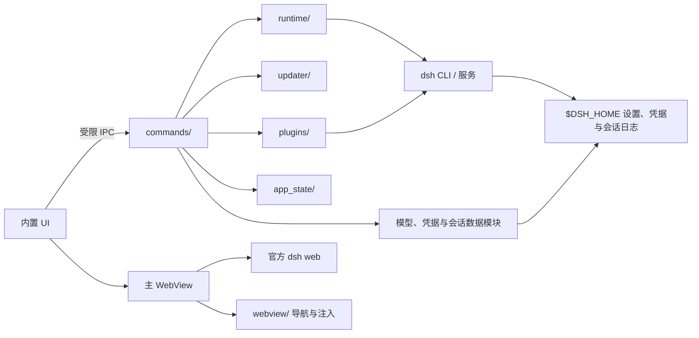
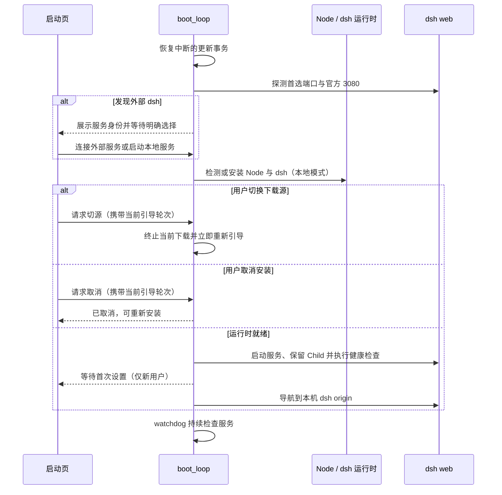

# 架构

## 目标与约束

DSHBox 是 dsh 的薄桌面外壳。对话、Agent、工具、会话格式和官方 Web UI 仍由 dsh 负责；桌面端只管理运行时、生命周期与操作系统集成。任何新能力必须落在页面注入、`$DSH_HOME` 数据或 `dsh` CLI 三条通道之一。

## 模块边界

- `bootstrap.rs` 组装 Tauri 插件、窗口、事件和后台任务；`lib.rs` 只保留跨模块公共边界。
- `commands/` 不实现业务，所有 IPC 首先要求调用方是内置页面。
- `app_state/config.rs` 解析用户配置与环境变量；`store.rs` 区分 `config.json` 和 `state.json`；`managed_file.rs` 提供串行、原子文本替换。
- `runtime/` 负责“可运行”，`dsh.rs` 负责“持续运行”，`updater/` 负责“安全替换”，三者不互相复制流程。
- `webview/` 处理可信 origin、自定义协议和导航后注入。右键菜单脚本独立放在 `resources/injections/`，便于语法和契约检查。

## 启动时序

首次配置不是独立启动线程：它是 `boot_inner` 中的等待点。`boot_once` 把内部错误映射为就绪、取消、切源重启或失败四种业务结果，避免取消操作短暂显示成启动失败。

本地端口只尝试 `state.json` 中的上次成功值与用户首选值；均不可绑定时传 `--port 0`，从 dsh 标准输出解析实际端口并持久化。端口探测区分 `Free`、`Listening` 与 `Unbindable`，Windows 保留端口不会触发无意义的 HTTP 重试。启动后的 `Child` 由 `AppState` 持有，绑定失败或缺包等早退可立即呈现日志，而不是等待 120 秒超时。

服务归属只有托管、外部、外部断开和未连接四种状态。外部候选必须同时通过 dsh 页面标记与 `host.describe` RPC 校验；当前上游未提供 `DSH_HOME`/实例 ID，因此候选指纹仅用于判断“是否还是上次那一个”，不能证明数据目录相同。首次连接外部服务时，本地凭据与插件引导只会被暂缓；日后首次改用本地服务时恢复，已用过本地服务的用户不会重复引导。外部模式禁止进程重启、dsh/Node/npm 更新、插件维护和 dsh 数据文件写入；看门狗只报告断开，不会静默换成本地服务。

## 数据所有权

| 数据 | 所有者 | DSHBox 行为 |
|---|---|---|
| `config.json` | DSHBox/用户 | 读写用户设置 |
| `state.json` | DSHBox | 内部状态，不建议手改 |
| `$DSH_HOME/settings.yaml` | dsh/用户 | 只合并约定段落 |
| `$DSH_HOME/.credentials.yaml` | dsh/用户 | 只合并指定凭据行 |
| 会话日志 | dsh | 只读统计与通知 |
| `node/`、`dsh/` | DSHBox | 事务化安装和更新 |

连接外部 dsh 时，表中 `$DSH_HOME` 与托管运行时相关的写操作全部暂停；DSHBox 没有可靠路径把本机数据目录假定成外部服务的数据目录。

`config.json` 与 `state.json` 不做跨文件兜底或隐式迁移。API Key 不属于 DSHBox 配置，只从环境变量或 dsh 的 `.credentials.yaml` 读取。

插件安装、卸载和更新先形成内存中的“待应用”状态：手动操作允许继续批量修改，用户确认后再合并为一次服务重启；后台维护只在 RPC 能明确确认会话空闲时重启。重启前记录当前 dsh URL，服务恢复后回到原会话位置。

## 更新不变量

- dsh/Node 的目录替换必须复用 `updater/transaction.rs`：备份、标记、校验、提交或回滚。
- Windows 应用附件必须来自精确版本 tag 的唯一资产，先写 `.part` 并验证 Release digest，再进入替换脚本。
- 失败或进程中断后必须保留足以恢复的备份和标记；不能为了“清理干净”删除最后一份可用版本。

## 前端组织

内置页没有打包器。HTML 只保留结构，页面级样式/逻辑使用同名 CSS/JS；`common.css` 是设计 token 和共享组件，`common.js` 是工具，`i18n.js` 是唯一双语文案表。动态 HTML 的文本必须经过转义或 DOM `textContent`。

这套方案降低构建复杂度，代价是没有模块打包与静态类型检查，因此 `npm run check` 会遍历全部受控文件，检查 JS 语法、HTML 本地引用、i18n 完整性、资源清单、图标和右键注入契约。插件网络/进程操作和会话统计查询都放入阻塞任务池，避免占住 UI 的异步执行线程。
